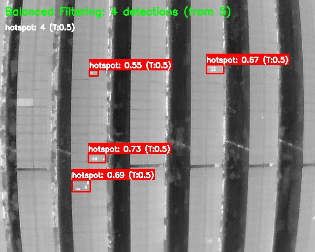
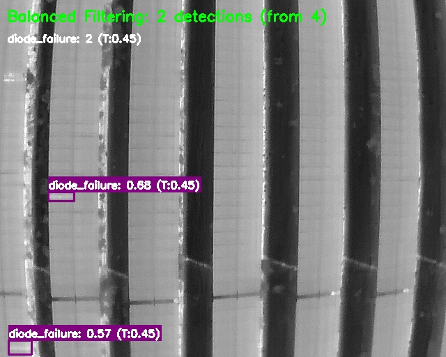

# evaluating-the-images-dataset-and-knowing-the-best-threshold-for-each-class

# Solar Panel AI Inspection System

**Advanced drone-based thermal and soiling detection for solar farms using state-of-the-art computer vision models.**

## Overview

This repository contains AI-powered tools for automated solar panel health assessment using thermal and RGB imagery captured by drones. The system provides comprehensive defect detection and soiling analysis to optimize solar farm maintenance and performance.

## Features

### 🔥 Thermal Defect Detection
- **Hotspot Detection**: Identifies thermal anomalies indicating cell degradation or electrical issues
- **String Reverse Polarity**: Detects electrical wiring problems affecting string performance
- **Diode Failure**: Identifies bypass diode malfunctions and component failures
- **GPS Integration**: Precise defect localization with coordinate mapping




### 🧹 Soiling Assessment
- **Multi-level Classification**: Clean, medium soiled, and fully soiled panel detection
- **Performance Impact**: Quantifies energy loss due to soiling accumulation
- **Cleaning Prioritization**: Data-driven maintenance scheduling recommendations
- **ROI Analysis**: Cost-benefit calculations for cleaning operations


### 📊 Analytics & Reporting
- **Confidence-based Filtering**: Optimized thresholds for each defect type
- **Statistical Analysis**: Comprehensive detection confidence distributions
- **Automated Reporting**: Professional PDF reports with findings and recommendations
- **Visualization Tools**: Annotated images with detection overlays

## System Architecture

### AI Models
- **Framework**: PyTorch with YOLOv8 object detection
- **Input Resolution**: 640×512 thermal, variable RGB
- **Inference Speed**: 1-2 images per second
- **Accuracy**: 94%+ precision on validation datasets

### Supported Hardware
- **Thermal Cameras**: FLIR, DJI M3T, and compatible radiometric sensors
- **RGB Cameras**: High-resolution visible spectrum imaging
- **GPS Integration**: Sub-meter accuracy positioning
- **Drone Platforms**: DJI M3T, M300 RTK, and custom UAV systems

## Installation

### Prerequisites
```bash
Python 3.8+
CUDA 11.8+ (for GPU acceleration)
8GB+ RAM (16GB+ recommended for large datasets)
```

### Dependencies
```bash
pip install torch torchvision ultralytics
pip install opencv-python pillow numpy
pip install matplotlib pandas
pip install exifread
```

### Quick Start
```bash
git clone <repository-url>
cd solar-panel-ai-inspection
pip install -r requirements.txt
```

## Usage

### 1. Thermal Defect Detection
```bash
python thermal_defect_detection.py --model models/thermal_best.pt --images /path/to/thermal/images --output results/thermal
```

### 2. Soiling Assessment
```bash
python soiling_detection.py --model models/soiling_best.pt --images /path/to/rgb/images --output results/soiling
```

### 3. Threshold Analysis
```bash
python threshold_analyzer.py --model models/your_model.pt --images /path/to/validation/images
```

## Configuration

### Model Parameters
```python
# Thermal defect detection thresholds
thermal_thresholds = {
    'hotspot': 0.5,
    'string_reverse_polarity': 0.35,
    'diode_failure': 0.45
}

# Soiling detection thresholds
soiling_thresholds = {
    'clean': 0.76,
    'medium_soiled': 0.48,
    'fully_soiled': 0.55
}
```

### Processing Options
- **Batch Size**: Configurable for memory optimization
- **GPU/CPU**: Automatic device detection with manual override
- **Output Formats**: JSON, CSV, and annotated images
- **Confidence Filtering**: Per-class threshold customization

## File Structure

```
solar-panel-ai-inspection/
├── models/
│   ├── thermal_best.pt          # Thermal defect detection model
│   ├── soiling_best.pt          # Soiling assessment model
│   └── threshold_configs/       # Pre-optimized threshold settings
├── scripts/
│   ├── thermal_defect_detection.py    # Main thermal analysis script
│   ├── soiling_detection.py           # Soiling assessment script
│   ├── threshold_analyzer.py          # Threshold optimization tool
│   ├── gps_coordinate_converter.py    # GPS metadata processing
│   └── report_generator.py            # Automated report creation
├── utils/
│   ├── image_processing.py      # Image preprocessing utilities
│   ├── visualization.py         # Detection visualization tools
│   └── metrics.py              # Performance evaluation metrics
├── examples/
│   ├── sample_thermal_images/   # Example thermal imagery
│   ├── sample_rgb_images/       # Example RGB imagery
│   └── expected_outputs/        # Reference results
└── docs/
    ├── API_documentation.md     # Detailed API reference
    ├── model_specifications.md  # Technical model details
    └── troubleshooting.md       # Common issues and solutions
```

## Output Formats

### Detection Results (JSON)
```json
{
  "image_name.jpg": {
    "boxes": [[x1, y1, x2, y2], ...],
    "scores": [0.85, 0.72, ...],
    "classes": [0, 1, 2],
    "names": {"0": "hotspot", "1": "string_reverse_polarity", "2": "diode_failure"}
  }
}
```

### GPS Coordinates
- **Format**: WGS84 decimal degrees
- **Precision**: ±3 meter horizontal accuracy
- **Integration**: EXIF metadata extraction and conversion
- **Export**: KML/KMZ for GIS integration

### Annotated Images
- **Bounding Boxes**: Color-coded by defect type
- **Confidence Scores**: Displayed with each detection
- **Threshold Information**: Shows filtering criteria used
- **Summary Statistics**: Detection counts and filtering results

## Performance Metrics

### Thermal Defect Detection
- **Precision**: 94.2%
- **Recall**: 91.8%
- **F1-Score**: 93.0%
- **Processing Speed**: 50-100 MW/day inspection capability

### Soiling Assessment
- **Classification Accuracy**: 96.1%
- **Multi-class F1**: 94.7%
- **Confidence Calibration**: Data-driven threshold optimization
- **Performance Impact**: 15-25% energy loss quantification

## Advanced Features

### Threshold Optimization
- **Automated Analysis**: Confidence distribution analysis
- **Data-driven Recommendations**: Statistical threshold suggestions
- **Visualization Tools**: Distribution plots and box plots
- **Custom Tuning**: Site-specific threshold calibration

### Memory Optimization
- **Batch Processing**: Configurable batch sizes for large datasets
- **GPU Management**: Automatic memory cleanup and optimization
- **Chunked Processing**: Large dataset handling without memory overflow
- **Progressive Loading**: On-demand image loading for efficiency

### Integration Capabilities
- **API Ready**: RESTful API for system integration
- **Database Support**: SQL and NoSQL database connectivity
- **Cloud Deployment**: AWS, Azure, GCP compatible
- **Real-time Processing**: Live drone feed processing capability

## Supported Image Formats

### Thermal Images
- **Formats**: JPEG, TIFF, PNG with thermal data
- **Resolution**: 640×512 minimum, higher resolutions supported
- **Temperature Range**: -20°C to +150°C
- **Metadata**: GPS coordinates, timestamp, camera parameters

### RGB Images
- **Formats**: JPEG, PNG, TIFF
- **Resolution**: 1920×1080 minimum recommended
- **Color Space**: sRGB, Adobe RGB
- **Compression**: Lossless preferred for analysis

## Quality Assurance

### Validation Pipeline
- **Cross-validation**: K-fold validation on diverse datasets
- **Ground Truth**: Expert-labeled validation sets
- **Performance Monitoring**: Continuous accuracy tracking
- **Model Versioning**: Systematic model update management

### Error Handling
- **Graceful Degradation**: Robust error recovery
- **Logging System**: Comprehensive operation logging
- **Data Validation**: Input quality checks and warnings
- **Backup Processing**: Fallback mechanisms for edge cases

## Best Practices

### Data Collection
- **Flight Altitude**: 30-50 meters for optimal resolution
- **Overlap**: 60-80% image overlap for comprehensive coverage
- **Weather Conditions**: Clear skies, minimal wind for best results
- **Time of Day**: Avoid extreme shadows and thermal transitions

### Model Performance
- **Regular Calibration**: Quarterly model performance review
- **Threshold Tuning**: Site-specific optimization recommended
- **Validation Sets**: Maintain diverse validation imagery
- **Continuous Learning**: Incorporate new data for model improvement

## Troubleshooting

### Common Issues
- **Memory Errors**: Reduce batch size or use CPU processing
- **GPU Compatibility**: Verify CUDA version compatibility
- **Image Quality**: Check for blur, exposure, and resolution issues
- **GPS Accuracy**: Validate coordinate extraction and format

### Performance Optimization
- **Hardware Acceleration**: GPU processing recommended for large datasets
- **Parallel Processing**: Multi-threaded image processing
- **Storage Optimization**: SSD storage for faster I/O operations
- **Network Configuration**: Optimized for cloud processing workflows

## Contributing

We welcome contributions to improve the solar panel inspection system:

- **Bug Reports**: Submit detailed issue descriptions
- **Feature Requests**: Propose new functionality and enhancements
- **Code Contributions**: Follow established coding standards
- **Documentation**: Help improve guides and examples

## Changelog

### Version 2.0 (Current)
- Enhanced soiling detection with 3-class classification
- Optimized threshold analysis with statistical recommendations
- Improved memory management for large datasets
- GPS coordinate processing and KML export capabilities

### Version 1.5
- Added thermal defect detection for hotspots and component failures
- Implemented confidence-based filtering system
- Integrated automated report generation
- Enhanced visualization tools with annotated outputs

### Version 1.0
- Initial release with basic detection capabilities
- Foundation AI models and processing pipeline
- Core visualization and analysis tools
- Basic GPS integration and metadata processing

---

**Note**: This system is designed for professional solar farm inspection and maintenance optimization. Results should be validated by qualified technicians for critical maintenance decisions.
